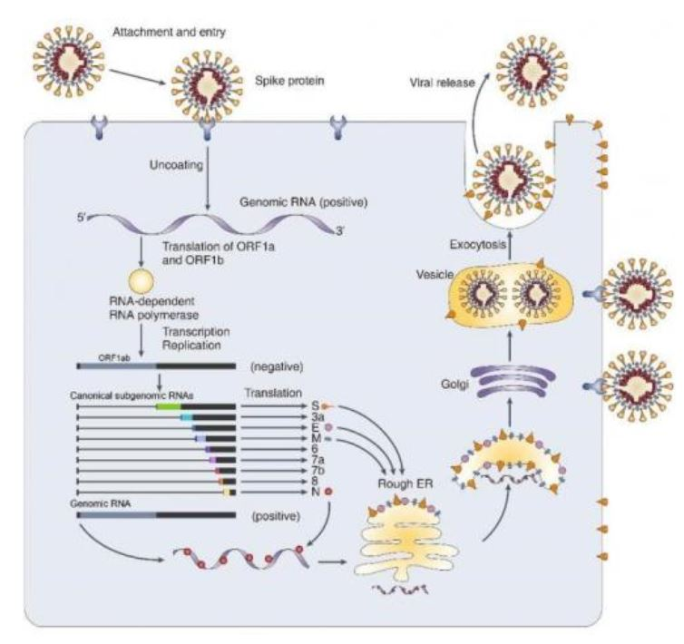

# Picornavirus - Rhino, 
**Plus Strand, Non-Enveloped**
- Enterovirus
  - Poliovirus
  - Coxsakievirus
  - Echovirus
  - Enterovirus D68
- Rhinovirus *only one that doesn't get past the nose/mouth*
- Hepatovirus
  - Hepatitis A
1. Start in respiratory tract.
2. Travel to target tissue *skin, muscle, brain, liver*
## Lifecycle
- **Bind** to cell using **viral capsid protein**
- Upon binding, change in virus structure.
  - RNA+ injected directly to cytoplasm
- Picorn genome has **one large ORF**, that makes a single polyprotein.
- 
- Several encoded proteins are **Proteases**, that cleave polyprotein into various proteins:
  - Capsid proteins
  - **Viral replicase (RDRP)**
  - VPg which bind viral 5'
- **RDRP is used to make complementary RNA+**, which makes more RNA+
- New RNA+ used to:
  - Make more viral prot
  - Template to make more -RNA
  - Package into capsid, make new virion
- Procapsid formed from protomers VP0,1,3. 
  - *5 protomers to form pentamer, 12 pentamer to form procapsid.*
- Viral Rna inserted into procapsid, *VP0 is cleaved into VP2 + VP4*, forming mature capsid
- Released by cell lysis (*cytolytic*)
## Poliovirus
- Enterovirus
- Entry into mouth
- Replication in pharynx, GI, lymphatics
- *Hematologic spread to lymphatics* -> **CNS Invasion**
- Viral spread along nerve fibers
- **Destruction of motor neurons**
- Salk Vaccine: Inactivated
- Sabin Vaccine: Live
## Coxsackieviruses: Group A and B
- Infants and children
- Fecal-oral tx
- Herpangina (mouth blisters) caused by A:
- Hand, Foot, Mouth commonly caused by Cox A16
- Cox B:
  - Myocarditis
  - Pleurodynia
  - Cox Asecepitc Meningitis
## Rhinoviruses
- Unable to replicate in Gi (labile to pH)
- Common cause of URT infection
- Tx as aerosole and on fomite
- Asymptomatic in many case
## Noroviruses
- Member of calicivirus
- Oral-fecal tx
- Resistant to heat, pH, detergent
- Food-borne, Direct contact
- Commonly outbreaks in long-term care facilities
- No specific treatment. Prevent dehydration
- Diagnosis:
  - Real time RT/PCR
  - EIA (enzyme immunoassay) for outbreaks. Not specific enough for individual cases
## Coronaviruses
- Nidovirales > Coronaviridae > Coronavirinae > Beta coronavirus > SARS-CoV, MERS-CoV, SARS-COV2
### SARS-COV2
- RNA+, 30 kb
- Structural proteins:  S, E, M, N
- Several viral enzymes
- Enveloped virion 80-100 nm
- Envelope contains club-shaped glycoprotein projects that appear crown-like.
- **S protein**:
  - Attaches to host ACE2 receptor using two subunits, S1 and S2
  - S1 determines host range and cellular tropism by RBD
  - S2 mediates virus-cell membrane fusion by HR1 and HR2
  - Animals were intermediate host, no ACE2 binding in non-humans
- **M protein**
  - Responsible for transmembrane transport of nutrients, bud relase, and envelope formation
- **N E protein**:
  - Interfere with host immune response
- Host Factors:
  - **hACE2**
  - Elderly more susceptible
  - *CPE* Cytopathic effect and cytokine storm.
  ### Replication:
  1. Spike binds ACE2 receptor. Remove envelope
  2. Translate ORF1a/b
  3. Cleave proteins. Repl/Transcriptionm complex use RNA+ as templat
  4. RNA+ produced through replication, becomes genome for baby virus
  5. NESTED RNA from step 4 translated into S E M N proteins, make viral particle
  6. Spike, envelope and membrane enter ER and nucleocapsid protein combine dwith RNA+ genomic RNA. Merge into complete virus in ER-Golgi and get excreted.
  - 
  - Seven human coronaviruses, some common ones:
    - 229E (alpha)
    - NL63 (alpha)
    - OC43 (beta)
    - HKU1 (beta)
  - Common cause of URT infect in adult.
  - Second most common cause of 'cold', right behind rhinovirus.
  - Occasionally cause enteric infect.
  - Rarely cause neuroligcial
  - Sometimes cornavirus that infect animals evolve and become human coronavirus:
    - MERS-CoV
    - SARS-CoV
    - SARS-CoV-2
### SARS-COV
- person-person tx
- most virulent during 2nd week of illness, peak of respiratory excretion
- MOst case of human-human occur in health care setting
- Symptoms:
  - influenza-like
  - fever, malaise, myalgia, headache, diarrhea, shivereing
  - Cough, SoB, diarrhea in first/second week
  - sever case evolve rapidly, progress to respiratory distress -> ICU
### MERS-CoV

## URT
- Causes: 90% due to viruses, 10% Bacteria
- The common cold: runny nose, sore throat, sneezing, “bronchitis”, coughing, headaches, body aches, low grade fever.
- Over 200 viruses in many different families can cause upper respiratory infections;
- Rhinovirus (Picornaviridae)*
- Coronavirus (Coronaviridae)*
- Adenovirus (Adenoviridae)*
- RSV (Paramyxoviridae)
- Parainfluenza (Paramyxoviridae)
- Influenza (Orthomyxoviridae)
### Rotavirus
  - Respiratory, Enteric, Orphan
  - Group A-E. Group A most common cause of childhood diarrhea and dastroenteritis
  - Non-eveloped, double layer capsid
  - Survive gGI
  - 50% hospitalization in children with diarrhea during autom winter spring
  - NSP4 protein has toxin-like activity
  - Two vaccine (live, oral)

