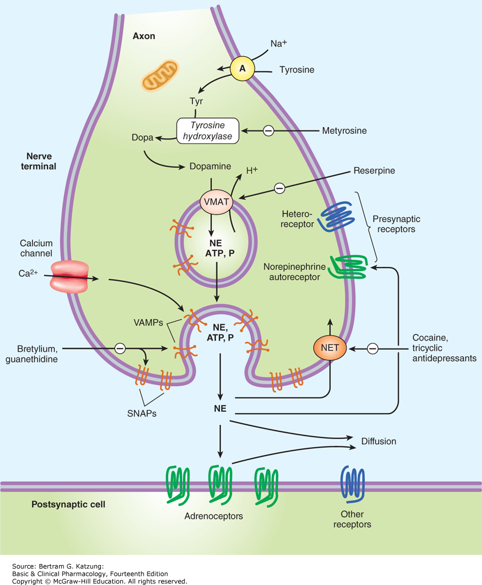

# Peripheral Nervous System
### Describe the organization
- Pre and postganglionic neurons
- Cell bodies of pre-gang in spinal cord
- Axons of post-gang mostly unmyelinated
- Somatomotor nervous system:  the neuron that leaves the spinal cord projects directly to the effector organ.
- Autonomic nervous system: synapse between the neuron that leaves the spinal cord and the effector organ 
    - except for neurons that innervate the adrenal medulla 
- Note all neurons that leave the CNS release acetylcholine (ACh).
- Parasympathetic release ACh pre and post-gang.
- Sympathetic release ACh pre-gang, and then an adrenergic NT post-gang.
- Sympathetic in thoracolumbar > Paravertebral Gang > Effectors
- Parasympathetic is craniosacral > Effector or Vagal Nerve > Sacral > Effector

### Cite primary neurotransmitters
- ACh is neurotransmitter released by all neurons whose axons exit the CNS.
    - cranial motor neurons, α-motor neurons, γ-motor neurons, preganglionic sympathetic neurons, and preganglionic parasympathetic neurons
- Post-gang parasympathetic neurons also release acetylcholine 
- Post-gang sympathetic neurons release either norepinephrine, epinephrine or acetylcholine.
### The cholinergic autonomic neurons (ie, release acetylcholine) are 
1. All pregang neurons
2. All parasympathetic postgang neurons
3. Sympathetic postgang neurons innervate sweat glands
4. Sympathetic postgang neurons ending on vessels skeletal muscles and produce vasodilation when stimulated (sympathetic vasodilator nerves).
- Remaining sympathetic postganglionic neurons are noradrenergic (ie, release norepinephrine). 
- Adrenal medulla is essentially a sympathetic ganglion in which the postgang cells have lost their axons and secrete both **norepinephrine** and **epinephrine** directly into the bloodstream.

### Describe synthesis, metabolism, storage, and termination of action of those neurotransmitters
1. Neurotransmitters are synthesized
2. Stored in the nerve endings
3. Released near the neurons, muscle cells, or gland cells
4. They bind to various ion channels or G-protein-coupled receptors (GPCR)
5. Initiate their characteristic actions. 
6. The neurotransmitters are then removed from the area by reuptake or metabolism. 
- Each of these steps can be stimulated or inhibited, with predictable consequences.

## List respective receptors and subtypes. Describe the main transduction mechanisms and when the receptors are stimulated.
### Nicotinic
- **ACh from postgang acting on Nicotinic Receptors**:  Causes a Na or K channel to open and depolarization. Nicotinic Receptors are ligand-gated ion channels. 
    - Nn receptors are in autonomic ganglia. Blocked by hexamethonium.
    - Nm receptors in neuromuscular junctions and blocked by curare.
- Responses by post-gang include: Fast EPSP that generates AP's and is produced by ACh on Nn receptors. Slow EPSP which modulates transmission through sympathetic gang and is produced by ACh on muscarinic receptor on post-gang neuron.
### Muscarinic
- **ACh from postgang acting on muscarinic cholinergic receptors**: Act on GPCR's and have a activating or inhibitory effect depending on what class of receptor.
- Muscarinic receptors and are blocked by **atropine**. 
- **Muscarinic** receptors are GPCR and are divided into subtypes:
    - M1–M5; M2 and M3 in autonomic target organs. 
    - M2 receptors are found in the heart
        - Binding agonist opens K+ channels and inhibits adenylyl cyclase. 
    - M3 receptors are located on smooth muscle and glands 
        - Binding agonist leads to (IP3) & (DAG) >> increase in Ca2+.
- Compounds with muscarinic actions include congeners of acetylcholine and drugs that inhibit acetylcholinesterase.
    +  Cholinesterase Inhibitor Effects: **Inhibits the breakdown of ACh, so increase the muscarinic effect**
        - Excessive activation of autonomic muscarinic receptors; these include miosis, salivation, sweating, bronchial constriction, vomiting, and diarrhea. 
        - CNS signs of toxicity include cognitive disturbances, convulsions, seizures, and even coma; these signs are often accompanied by nicotinic effects such as depolarizing neuromuscular blockade.
    + Muscarinc Cholinergic Receptor Antagonist: Atropine **Blocks ACh from binding to muscarinic receptors, decreasing the effect**
### Noradrenergic
 - Norepinephrine spreads farther and has a more prolonged action than acetylcholine. 
 - Norepinephrine, epinephrine, and dopamine are all found in plasma. 
    - The epinephrine and some of the dopamine come from the adrenal medulla
    - But most of the norepinephrine diffuses into the bloodstream from sympathetic nerve endings.
- Norepinephrine released from sympathetic post-gang binds to adrenoceptors: 
    - **GPCR α1, α2, β1, β2, and β3.**
    - Binding α1 → Gq → IP3+DAG = ↑↑↑↑ Ca2+. 
    - Binding α2 → Gi X adenylyl cyclase ↓↓↓↓ cAMP. 
    - Binding  β → Gs → adenylyl cyclase ↑↑↑↑ cAMP.
- Horner syndrome is a result of dysfunctional sympathetic innervation.
    - Anhidrosis (reduced sweating), ptosis (drooping eyelid), and miosis (constricted pupil). Also enophthalmos (sunken eyeball) and vasodilation.

|       |Ligands of Adrenoceptors                                                                                                                                                                    |      |   |
|-------|--------------------------------------------------------------------------------------------------------------------------------------------------------------------------------------------|------|---|
| Alpha1|Postsynaptic effector cells, especially smooth muscle                                                                                                                                       |Norepi|Epi|
| Alpha2|Presynaptic adrenergic nerve terminals, platelets, lipocytes, smooth muscle                                                                                                                 |Norepi|Epi|
| Beta1 |Postsynaptic effector cells, especially heart, lipocytes, brain; presynaptic adrenergic and cholinergic nerve terminals, juxtaglomerular apparatus of renal tubules, ciliary body epithelium|Norepi|Epi|
| Beta2 |Postsynaptic effector cells, especially smooth muscle and cardiac muscle                                                                                                                    |      |Epi|
| Beta3 |Postsynaptic effector cells, especially lipocytes; heart                                                                                                                                    |Norepi|   |

.  
.  
.  
.  

### Associate target organs and physiological action when receptors are stimulated. Consider the affinities, when descrbing norephedrine and epinephrine.
- Adrenergic neurons transport precusor amino acid tyrosine to the nerve ending, convert it to dopa, and then synthesize a catecholamine (dopamine, norepi, epi)
- In most sympathetic postganglionic neurons, norepinephrine is the final product. 
- In the adrenal medulla and certain areas of the brain, some norepinephrine is further converted to epinephrine. In dopaminergic neurons, synthesis terminates with dopamine.
- ACh by α-motor neurons only leads to contraction of skeletal muscles. 
- ACh onto smooth muscle organs leads to contraction (eg, walls of the gastrointestinal tract) or relaxation (eg, sphincters in the gastrointestinal tract).
- The only way to relax a skeletal muscle is to stop discharging from motor neuron.
- For muscle innervated by ANS:
    - contraction can shift to relaxation by switching from parasympathetic to sympathetic.
    - Dual innervation with antagonistic effects:
        - heart, airways, digestive tract, and urinary bladder
    - Antagonistic Version: 
        - **sympathetic increases heart rate**
        - **parasympathetic decreases heart rate**
    - Complementary Version:
        - **Parasympathetic causes release of watery saliva**
        - **Sympathetic causes production of thick, viscous saliva.**
    - Synergistic Version:
        - Control of pupil diameter in the eye. 
        - **Sympathetic and parasympathetic are excitatory.**
        - **Sympathetic** contracts the radial (or dilator) muscle to cause **mydriasis (widening of the pupil)**
        - **Parasympathetic** contracts the sphincter (or constrictor) muscle to cause **miosis (narrowing of the pupil)**
    - Exclusivity:
        - Sympathetic: Adrenal gland, most blood vessels, the pilomotor muscles, sweat glands.
        - Parasympathetic: lacrimal muscle, ciliary muscle, and nasopharyngeal gland.
    - Fight or Flight: Sympathetic
        - Dilates the pupils (letting more light into the eyes)
        - Accelerates the heartbeat and raises the blood pressure (providing better perfusion of the vital organs and muscles)
        - Constricts the blood vessels of the skin (which limits bleeding from wounds). 
        - Noradrenergic discharge also leads to elevated plasma glucose and free fatty acid levels
    - Rest and Digest: Parasympathetic
        - Favors digestion and absorption of food. 
        - Increase the activity of the intestinal musculature
        - Increase gastric secretion
        - Relax the pyloric sphincter

# Central Nervous System
### List effects triggered by ACh and catecholamines (NE, DA), acting on the CNS.

# End of Chapter Notes:
- Preganglionic sympathetic neurons are located in the spinal thoracolumbar IML and project to postganglionic neurons in the paravertebral or prevertebral ganglia or the adrenal medulla. Preganglionic parasympathetic neurons are located in motor nuclei of cranial nerves III, VII, IX, and X and the sacral IML and project to ganglia located in or near the effector target. The targets of the ANS include smooth muscle, cardiac muscle and pacemaker cells, exocrine and endocrine glands, adipose tissue, liver cells, and lymphatic tissue.

- Acetylcholine is released at nerve terminals of all preganglionic neurons, postganglionic parasympathetic neurons, and a few postganglionic sympathetic neurons (sweat glands and sympathetic vasodilator fibers). The remaining sympathetic postganglionic neurons release norepinephrine.

- Ganglionic transmission is mediated by activation of nicotinic receptors. Postganglionic cholinergic transmission is mediated by activation of muscarinic receptors. Postganglionic adrenergic transmission is mediated by activation of α1-, β-, or β2-adrenoceptors, depending on the target organ.

- Many commonly used drugs exert their therapeutic actions by serving as agonists (eg, bethanecol, phenylephrine, albuterol) or antagonists (eg, atropine, phenoxybenzamine, atenolol) at autonomic synapses, by blocking neurotransmitter synthesis (eg, metyrosine), or by blocking neurotransmitter release (eg, tricyclic antidepressants).

- The ANS works in concert with the endocrine system to maintain homeostasis or a stable internal environment despite challenges imposed by shifts in things such as air temperature, oxygen and carbon dioxide levels, physical activity, exposure to toxins, disease, drug therapies, fever, and diet.

- Sympathetic activity prepares the individual to cope with an emergency by accelerating the heartbeat, raising blood pressure (perfusion of the vital organs), and constricting the blood vessels of the skin (limits bleeding from wounds). Parasympathetic activity is concerned with the vegetative aspects of day-to-day living and favors digestion and absorption of food by increasing the activity of the intestinal musculature, increasing gastric secretion, and relaxing the pyloric sphincter.

- At many organs that receive dual innervation (eg, heart, airways, digestive tract, and urinary bladder), the two divisions of the ANS act as physiological antagonists. In other cases, the two divisions of the ANS can act in a synergistic manner in the control of some functions (eg, control of pupil diameter). Some organs are innervated by only the sympathetic (eg, blood vessels) or only parasympathetic (eg, ciliary muscle) nervous system.

- Direct projections to sympathetic preganglionic neurons in the IML originate in the hypothalamic paraventricular nucleus, pontine catecholaminergic A5 cell group, rostral ventrolateral medulla, and medullary raphe nuclei.

- The enteric nervous system is located within the wall of the digestive tract and is composed of the myenteric plexus (control of digestive tract motility) and the submucosal plexus (regulates gastrointestinal blood flow and epithelial cell function).

# Adrenergic Junctions
- Schematic diagram of a generalized noradrenergic junction (not to scale). Tyrosine is transported into the noradrenergic nerve ending or varicosity by a sodium-dependent carrier (A). Tyrosine is converted to dopamine (see Figure 6–5 for details), and transported into the vesicle by the vesicular monoamine transporter (VMAT), which can be blocked by reserpine and tetrabenazine. The same carrier transports norepinephrine (NE) and several related amines into these vesicles. Dopamine is converted to NE in the vesicle by dopamine-β-hydroxylase. Physiologic release of transmitter occurs when an action potential opens voltage-sensitive calcium channels and increases intracellular calcium. Fusion of vesicles with the surface membrane results in expulsion of norepinephrine, cotransmitters, and dopamine-β-hydroxylase. Release can be blocked by drugs such as guanethidine and bretylium. After release, norepinephrine diffuses out of the cleft or is transported into the cytoplasm of the terminal by the norepinephrine transporter (NET), which can be blocked by cocaine and certain antidepressants, or into postjunctional or perijunctional cells. Regulatory receptors are present on the presynaptic terminal. SNAPs, synaptosome-associated proteins; VAMPs, vesicle-associated membrane proteins.

| Effector Organs              | Parasympathetic Nervous System | Sympathetic Nervous System |
| ---------------------------- | ------------------------------ | -------------------------- |
| Receptor Type                | Response                       |
| Eyes                         |                                |                            |  |
|  Radial muscle of iris       | —                              | α1                         | Contraction (mydriasis) |
|  Sphincter muscle of iris    | Contraction (miosis)           | α1                         | — |
|  Ciliary muscle              | Contraction for near vision    | α1                         | — |
| Heart                        |                                |                            |  |
|  SA node                     | Decreased heart rate           | β1                         | Increased heart rate |
|  Atria and ventricle         | Decreased atrial contractility | β1, β2                     | Increased contractility |
|  AV node and Purkinje fibers | Decreased conduction velocity  | β1                         | Increased conduction velocity |
| Arterioles                   |                                |                            |  |
|  Skin, splanchnic vessels    | —                              | α1                         | Constriction |
|  Skeletal muscle             | —                              | α1/ β2, M                  | Constriction/Dilation |
| Systemic veins               | —                              | α1, α2/ β2                 | Constriction/Dilation |
| Bronchial smooth muscle      | Contraction                    | β2                         | Relaxation |
|  Stomach and Intestine       |                                |                            |  |
|  Motility and tone           | Increased                      | α1, α2, β2                 | Decreased |
|  Sphincters                  | Relaxation                     | α1                         | Contraction |
|  Secretion                   | Stimulation                    |  —                         |  |
| Gallbladder                  | Contraction                    | β2                         | Relaxation |
|  Urinary bladder             |                                |                            |  |
|  Detrusor                    | Contraction                    | β2                         | Relaxation |
|  Sphincter                   | Relaxation                     | α1                         | Contraction |
| Uterus (pregnant)            | —                              | α1/ β2                     | Contraction/Relaxation |
| Male sex organs              | Erection                       | α1                         | Ejaculation |
|  Skin                        |                                |                            |  |
|  Pilomotor muscles           | —                              | α1                         | Contraction |
|  Sweat glands                | —                              | M                          | Secretion |
| Liver                        | —                              | α1, β2                     | Glycogenolysis |
|  Pancreas                    |                                |                            |  |
|  Acini                       | Increased secretion            | α                          | Decreased secretion |
|  Islet cells                 | —                              | α2/β2                      | Decreased/Increased secretion |
| Salivary glands              | Profuse, watery secretion      | α1/β                       | Thick, viscous secretion/Amylase secretion |
| Lacrimal glands              | Secretion                      |                            | — |
| Adipose tissue               | —                              | β3                         | Lipolysis |

.  
.  
.  
.  

| Receptor Name      | Typical Locations                                                                                                                                                                            | Result of Ligand Binding                                                                        |
| ------------------ | -------------------------------------------------------------------------------------------------------------------------------------------------------------------------------------------- | ----------------------------------------------------------------------------------------------- |
| Cholinoceptors     |
|  Muscarinic M1     | CNS neurons, sympathetic postganglionic neurons, some presynaptic sites                                                                                                                      | Formation of IP3 and DAG, increased intracellular calcium                                       |
|  Muscarinic M2     | Myocardium, smooth muscle, some presynaptic sites; CNS neurons                                                                                                                               | Opening of potassium channels, inhibition of adenylyl cyclase                                   |
|  Muscarinic M3     | Exocrine glands, vessels (smooth muscle and endothelium); CNS neurons                                                                                                                        | Like M1 receptor-ligand binding                                                                 |
|  Muscarinic M4     | CNS neurons; possibly vagal nerve endings                                                                                                                                                    | Like M2 receptor-ligand binding                                                                 |
|  Muscarinic M5     | Vascular endothelium, especially cerebral vessels; CNS neurons                                                                                                                               | Like M1 receptor-ligand binding                                                                 |
|  Nicotinic NN      | Postganglionic neurons, some presynaptic cholinergic terminals; pentameric receptors typically contain α- and β-type subunits only                                                           | Opening of Na+, K+ channels, depolarization                               |
|  Nicotinic NM      | Skeletal muscle neuromuscular end plates; receptors typically contain two α1\- and β1\-type subunits in addition to γ and δ subunits                                                         | Opening of Na+, K+ channels, depolarization                               |
| Adrenoceptors      |
|  Alpha1            | Postsynaptic effector cells, especially smooth muscle                                                                                                                                        | Formation of IP3 and DAG, increased intracellular calcium                                       |
|  Alpha2            | Presynaptic adrenergic nerve terminals, platelets, lipocytes, smooth muscle                                                                                                                  | Inhibition of adenylyl cyclase, decreased cAMP                                                  |
|  Beta1             | Postsynaptic effector cells, especially heart, lipocytes, brain; presynaptic adrenergic and cholinergic nerve terminals, juxtaglomerular apparatus of renal tubules, ciliary body epithelium | Stimulation of adenylyl cyclase, increased cAMP                                                 |
|  Beta2             | Postsynaptic effector cells, especially smooth muscle and cardiac muscle                                                                                                                     | Stimulation of adenylyl cyclase and increased cAMP. Activates cardiac Gi under some conditions. |
|  Beta3             | Postsynaptic effector cells, especially lipocytes; heart                                                                                                                                     | Stimulation of adenylyl cyclase and increased cAMP1                                  |
| Dopamine receptors |
|  D1 (DA1), D5      | Brain; effector tissues, especially smooth muscle of the renal vascular bed                                                                                                                  | Stimulation of adenylyl cyclase and increased cAMP                                              |
|  D2 (DA2)          | Brain; effector tissues, especially smooth muscle; presynaptic nerve terminals                                                                                                               | Inhibition of adenylyl cyclase; increased potassium conductance                                 |
|  D3                | Brain                                                                                                                                                                                        | Inhibition of adenylyl cyclase                                                                  |
|  D4                | Brain, cardiovascular system                                                                                                                                                                 | Inhibition of adenylyl cyclase                                                                  |

.  
.  
.  
.  

| Process Affected                      | Drug Example                                                         | Site                                                                                                                                                                   | Action                                                                     |
| ------------------------------------- | -------------------------------------------------------------------- | ---------------------------------------------------------------------------------------------------------------------------------------------------------------------- | -------------------------------------------------------------------------- |
| Action potential propagation          | Local anesthetics, tetrodotoxin, saxitoxin  | Nerve axons                                                                                                                                                            | Block voltage-gated sodium channels; block conduction                      |
| Transmitter synthesis                 | Hemicholiniums                                                       | Cholinergic nerve terminals: membrane                                                                                                                                  | Block uptake of choline and slow ACh synthesis                             |
|                                       | α-Methyltyrosine (metyrosine)                                        | Adrenergic nerve terminals and adrenal medulla: cytoplasm                                                                                                              | Inhibits tyrosine hydroxylase and blocks synthesis of catecholamines       |
| Transmitter storage                   | Vesamicol                                                            | Cholinergic terminals: VAT on vesicles                                                                                                                                 | Prevents storage, depletes                                                 |
|                                       | Reserpine, tetrabenazine                                             | Adrenergic terminals: VMAT on vesicles                                                                                                                                 | Prevents storage, depletes                                                 |
| Transmitter release                   | Many                                                     | Nerve terminal membrane receptors                                                                                                                                      | Modulate release                                                           |
|                                       | ω-Conotoxin GVIA                                        | Nerve terminal calcium channels                                                                                                                                        | Reduces transmitter release                                                |
|                                       | Domoic acid                                                          | Nerve terminal kainate receptors (primarily CNS) | Modulates transmitter release by altering calcium influx/release           |
|                                       | Botulinum toxin                                                      | Cholinergic vesicles                                                                                                                                                   | Prevents ACh release                                                       |
|                                       | α-Latrotoxin                                             | Cholinergic and adrenergic vesicles                                                                                                                                    | Causes explosive transmitter release                                       |
|                                       | Tyramine, amphetamine                                                | Adrenergic nerve terminals                                                                                                                                             | Promote transmitter release                                                |
| Transmitter reuptake after release    | Cocaine, tricyclic antidepressants, SNRI antidepressants | Adrenergic nerve terminals, NET                                                                                                                                        | Inhibit uptake; increase transmitter effect on postsynaptic receptors      |
| Receptor activation or blockade       | Norepinephrine                                                       | Receptors at adrenergic junctions                                                                                                                                      | Binds and activates a receptors; causes contraction                        |
|                                       | Phentolamine                                                         | Receptors at adrenergic junctions                                                                                                                                      | Binds a receptors; prevents activation                                     |
|                                       | Isoproterenol                                                        | Receptors at adrenergic junctions                                                                                                                                      | Binds β receptors; activates adenylyl cyclase                              |
|                                       | Propranolol                                                          | Receptors at adrenergic junctions                                                                                                                                      | Binds β receptors; prevents activation                                     |
|                                       | Nicotine                                                             | Receptors at nicotinic cholinergic junctions (autonomic ganglia, neuromuscular end plates)                                                                             | Binds nicotinic receptors; opens ion channel in postsynaptic membrane      |
|                                       | Tubocurarine                                                         | Neuromuscular end plates                                                                                                                                               | Prevents activation of nicotinic receptors                                 |
|                                       | Bethanechol                                                          | Receptors, parasympathetic effector cells (smooth muscle, glands)                                                                                                      | Binds and activates muscarinic receptors                                   |
|                                       | Atropine                                                             | Receptors, parasympathetic effector cells                                                                                                                              | Binds muscarinic receptors; prevents activation                            |
| Enzymatic inactivation of transmitter | Neostigmine                                                          | Cholinergic synapses (acetylcholinesterase)                                                                                                                            | Inhibits enzyme; prolongs and intensifies transmitter action after release |
|                                       | Tranylcypromine                                                      | Adrenergic nerve terminals (monoamine oxidase)                                                                                                                         | Inhibits enzyme; increases stored transmitter pool                         |