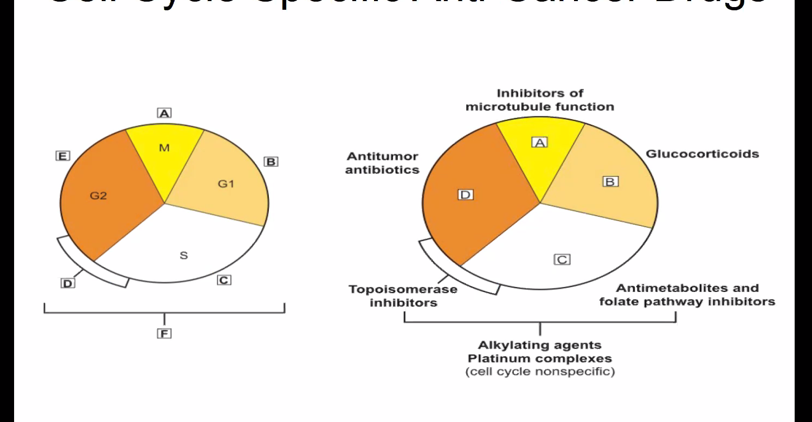
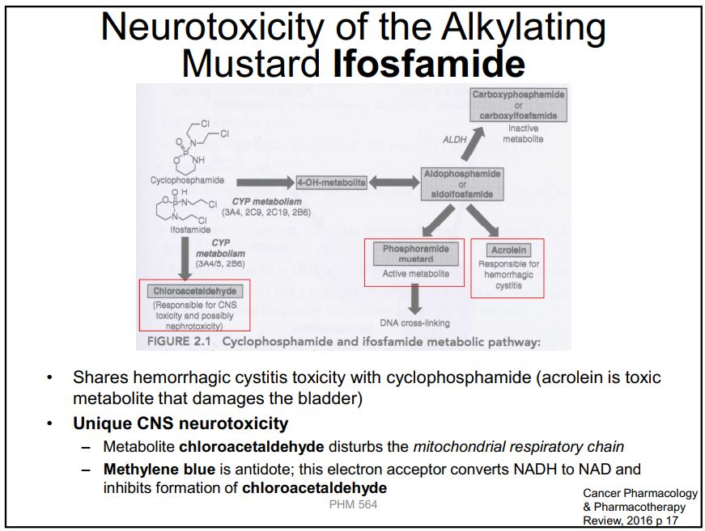

## Tumor Heterogeneity
- 2/3 of tumors do not have a single biopsy...


## Tumor Microenvironment
- Multiple cell types that support tumor growth
    - Immune cells
    - Fibroblasts
    - Endothelial cells
    - Vasculature
    - *Pancreatic cancer is not majorally cancerous cells, large portion is fibroblast*
- These microenvironment cells are all **targetable**

## Drug Resistance:
  - P-glycoprotein efflux pumps extrude chemotherapy drugs
  - Drug metabolism
  - Drug sequestration
  - Alter signal transduction pathways
  - Evade or ignore programmed cell death
## Chemotherapy:
  - Dev 1940-1960 for solid tumors, hematological malignancies
  - Integrated with surgery and radiation
  - Obstacles: 
    - R
    - Hurt normal cells   
## History:
    - Mechlorethamine
    - Anti-metabolites
      - Methotrexate and 5-fu
    - Vinca Alkaloid
    - Cisplatin to inhibit cell division and cure solid tumors
    - Cure of Hodgkin's disease and ALL
    - Adjuvant chemotherapy
    - Cure of testicular cancer (vinblastine + bleomycin + cisplatin)
    - Targeted Therapy:
      - Gleevec - RTK for CML
      - Rituximab - NHL
## Types of Chemo
- Primary Induction
    - advanced and no alternative
    - Palliative
    - Improve quality of life
    - Prolong time to tumor progression (TTP)
- Neoaduvnat
      - localized cancer
      - Not completely effective
      - Used when surgery is not possible
- Adjuvant
      - follow surgery and radiation
      - Reduce incidence of local and systemic recurrence
      - Improve overall survival **OS**
      - Prolong disease free survival **DFS**
## Targetting the Cell Cycle
-  
-  Cell survival exponentially related to dose
- Slope of curve related to rate of cell proliferation
- Effective against those cells that proliferate rapidly
- Cause of Side Effects
    - Bone marrow stem cells: Immunocompromise
    - GI mucosal cells: 
    - Hair Follicles: Alopecia
    - Ovaries testes
## Kinetics of Therapy
## Therapeutic Window
    - Goals are to maximize efficacy and limit tocicity
    - Usually use maximum tolerated dose
## Drug Resistance: Goldie-Coldman Model
  - Drug resistance probability is dependednt on intrinsic genetic instabillity
  - Event smallest deteable tumor contains at least 1 drug-resistant clone.
    - Use all effective chemo drugs
## Combination Chemotherapy
- 
## Route of Administration - 5-FU
- IV bolus dose vs IV continuous infusion
    - IV Bolous: Incorporate into cellular RNA and myelosuppression
    - IV Continuous: Incorporate into cellular DNA but skin toxicity
- Intermittent dose
    - 600mg/m2/cycle
    - No cardiac or bladder toxicity
    - Secondary malignancies can develop
- Single high dose
  - Cardiac toxicity
  - Hemorrhagic cystitis
- Daily Dose
    - Hemorrhagic cystitis
    - Secondary Malignancies
## Pharmacokinetics
- Phramocokinetics represents the kinetics of accumulation and disapperance from plasma

# Alkylating Agents
- Classes:
  1. **Nitrogen mustards**
  2. **Nitrosoureas**
  3. **Triazenes**
  4. **Platinum complexes**
## Alkylating Mustards: 
### General Mechanism:
 - Drug activated into *reative intermediates* that **form adducts** at N7 position of guanine in DNA
 - Loss of the guanine base (*depurination*) or miscoding of abnormal base pairing
 - Strand break or cross-linking of DNA
 - Cell death
 - 
 ```
 Alkylating groups on nitrogen mustard act as "warhead"
 N7 on guanine acts as electron donor, forming adduct
 React with 2nd guanine, leading to depurination
 ```
### Reactivity:
- Reactivity can be reduced by adding aromatic ring to warhead.
- Less reactivity allows for drug to be given orally.
  - Elderly patients with multiple myeloma or CLL
### Notes on Mustards  
#### Alkylating Mustards: **Cyclophosphamide and Ifosfamide** are **pro-drugs**
  - Share same active cytotoxic ingredient: phophoramide mustard
  - Both metabolized to **acrolein** (toxic to bladder - **hemorrhagic cystitis**)
#### Alkylating Mustards: **Cyclophosphamide and Ifosfamide** and acrolein toxicity
  - Hemorrhagic cystitis is dose and schedule dependent
  - Acreolin react with nucleophiles in uroepithelium:
    - Prevent with adequate hydration or MESNA
    - MESNA inactivates acrolein by binding to and preventing reaction with cellular nucleophiles
    - MESNA can prevent hemorrhagic cystitis, but not treat it.
    - Treatment is hydration with saline
    - **Blood in urine of PT treated with cyclophosphamide** is an early warning sign of bladder tox.
#### Alkylating Mustards: Ifosfamide Neurotoxicity:
  - Ifosfamide shares hemorrhagic cystits toxicity with cyclophosphamide - **acrolein**
  - Also has Unique CNS neurotoxicity: 
    - Chloroacetaldehyde distrub mitochondrial respiratory chain
    - **Methylene blue is the antidote**. Inhibits formation of **chloroacetaldehyde**
    - 
### Alkylating Nitrosoureas
- Liberate organic isocyanates
- React with lysine residues
- Inactivation of protein, esp DNA repair enzyme
- **Highly lipophillic** and used to treat brain tumor because **cross BBB**
### Alkylating Triazenes
- **Methylate** DNA at O6 and N7 positions on **Guanine**
- Temozolamide is **highly lipophillic**

### Alkylating Platinum Complexes
  - React with DNA to produce inter and intra strand crosslinnks between adjacent guanines, or guanine and adeninge
  - Produce **DNA adducts** that inhibit replication and transcription
  - **Cisplatin, Carboplatin**: 
    - Good for **neck cancer**. 
    - Cistplatin has **High nephrotoxicity**
    - Carboplatin has **low nephrotoxicity**
  - Oxaliplatin: 
    - More effective for **colon and pancreatic**
    **- Nephrotoxicity**
  - Oxaliplatin more potent than cisplatin in vitro and requires fewer DNA adducts to achieve cytotoxicity
  - Carboplatin is a larger molecule than cisplatin; longer retention and different toxicities (less)
  - **Cytotoxic activity against different tumors and toxicity NOT the same with different platinum compounds**
### Alkylating Miscellaneous: Procarbazine
  - MAOI: MAO - Inhibitor
## Summary of Alkylating:
  - Share similar mechanism of action:
    - Activated to reactive
    - Form adducts with cellular macromolecules
    - Methylkate DNA
    gernate isocyanates
- Same adverse effects:
    - Hemorrhagic cystitis
    - CNS toxicity
    - Nephrotoxicity and neuropathy
  - Lipophillic agents have unique applications
## Summary of Alkylating Agent Toxicity:
- More toxic to normal, rapidly proliferating cells
- Non-cell cycle specific
- Damage DNA
    - Increase mutations
    - Secondary malignancies are long-term
        - Leukemias
        - Myelodysplastic syndrome


