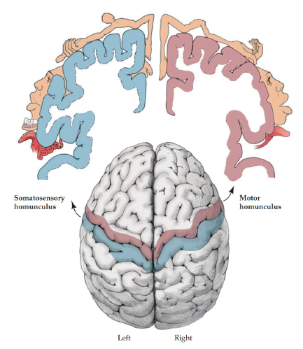

## LOs
1. Define and use following terms: circuit/pathway, decussation, lesion, primary/secondary/tertiary 
   neurons, homunculus
   * [Circuit/Pathway:](#principles-of-neurobiology) Functions of the nervous system rely on multiple, interconnected gray and white matter structures
  working together in a circuit. Function requires intact circuits. Damage to any part or to connections between parts breaks the
  circuit and overall function is lost or damaged.
   * [Decussation:](#principles-of-neurobiology) Decussation is the movement of a signal from one side of the body to the 
   contralateral side of the brain.
   * [Lesion:](#principles-of-neurobiology) area of abnormal tissue.
   * [Neurons:](#pain)
     * Primary: Enters from periphery into proximal portion of dorsal horn where it activates a synapse.
     * Secondary: Secondary neuron crosses midline and ascends up through a tract and through the 
     brainstem to the thalamus
     * Tertiary Neurons: At the thalamus, secondary synapse onto tertiary neurons. This synapse 
     allows for modulation
   * [Homunculus:](#homunculus) Somatosensory and Motor homunculus are a artistic representation of cortex body 
   mapping
2. [Describe in broad detail the pathway for detecting pain from the body, and how primary sensation
   is only one part of experiencing pain.](#pain)
   * Pain enters from periphery and travels along the distal portion of a *primary neuron* into the proximal
   portion located in the dorsal horn.
   * Primary activates a synapse in the dorsal horn, which allows for a reflex response and modulation.
     * Reflexes elicit a movement away from the painful thing before the pain is even processed by CNS
     * Synapse allows for modulation (intensity) of the painful signal (ascending/descending) 
   * Secondary neuron crosses midline and ascends up through a tract and through the brainstem to the
     thalamus
   * At the thalamus, secondary synapse onto tertiary neurons. This synapse allows for modulation.

3. [Describe the homunculus and its use.](#homunculus)
   * Somatosensory and Motor homunculus are a artistic representation of cortex body 
   mapping
4. [Describe the limbic system and its broad functions](#limbic-system)
   * Connects primary cortex stimuli to *context*.
   * Cingulate Gyrus: C-shaped, involved in *emotional* feeling.
   * Amygdala and hippocampus: *learning* pain as well as *recall*.
   * Hypothalamus: Evoke 'fight or flight' response
5. [Describe three major components of healthy movement and the nervous system structures associated
   with each.](#shared-processing---movement)
   * Nervous system needs to make muscles contract. *Corticospinal tract*
   * Contractions occur when you want, and not when you dont. *Basal Ganglia*
   * Contractions add up to complex movment should flow from one to another fluidly. *Cerebellum*
----------
### Pain:
* Pain enters from periphery and travels along the distal portion of a *primary neuron* into the proximal
  portion located in the dorsal horn.
* Primary activates a synapse in the dorsal horn, which allows for a reflex response and modulation.
  * Reflexes elicit a movement away from the painful thing before the pain is even processed by CNS
  * Synapse allows for modulation (intensity) of the painful signal (ascending/descending) 
* Secondary neuron crosses midline and ascends up through a tract and through the brainstem to the
  thalamus
* At the thalamus, secondary synapse onto tertiary neurons. This synapse allows for modulation.

### Homunculus
* All inputs and outputs of the cortex are bodymapped.
* Somatosensory and Motor homunculus are a artistic representation of cortex body mapping.

### Primary Sensation vs "Pain"
* Primary cortex detects a stimulus and informs other cortex, adding context to the signal.
* *Limbic System* 

### Limbic System
* Connects primary cortex stimuli to *context*.
* Cingulate Gyrus: C-shaped, involved in *emotional* feeling.
* Amygdala and hippocampus: *learning* pain as well as *recall*.
* Hypothalamus: Evoke 'fight or flight' response

### Principles of Neurobiology
* Functions of the nervous system rely on multiple, interconnected gray and white matter structures
  working together in a circuit.
* Function requires intact circuits. Damage to any part or to connections between parts breaks the
  circuit and overall function is lost or damaged.
* Decussation is the movement of a signal from one side of the body to the contralateral side of
  the brain. Pain decussates immediately, but not all pathways decussate immediately. Fine touch
  pathway ascends to the brainstem BEFORE it decussates.
* Any signals going to the cortex will have to pass through thalamus first.
* Inputs and outputs of the brain are body-mapped.
* Shared processing is essential for full effect. 
* Lesions: area of abnormal tissue.

### Shared Processing - Movement
* Nervous system needs to make muscles contract. *Corticospinal tract*
* Contractions occur when you want, and not when you dont. *Basal Ganglia*
* Contractions add up to complex movment should flow from one to another fluidly. *Cerebellum*
  